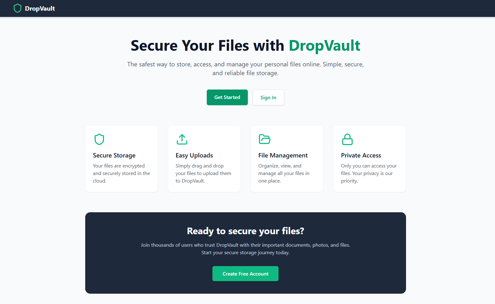

# DropVault



> **DropVault** is a modern, secure, and user-friendly web application for personal file storage. Effortlessly upload, manage, and access your files from anywhere, with privacy and security at the core.

---

## 🚀 Features

- **Secure Cloud Storage**: All files are encrypted and stored securely using [Supabase Storage](https://supabase.com/).
- **Easy Drag & Drop Uploads**: Upload images, PDFs, and documents with a simple drag-and-drop interface.
- **File Management**: View, download, and delete your files. Image thumbnails and file type icons for easy browsing.
- **Private Access**: Only you can access your files. Authentication is required for all file operations.
- **Responsive UI**: Beautiful, mobile-friendly design powered by React, Tailwind CSS, and Framer Motion.
- **Account Management**: Change your password and view your account details in the settings page.
- **Real-time Updates**: File list updates automatically when you upload or delete files.

---

## 🖥️ Screenshots

<p align="center">
  
  <br>
  
  <br>
  
</p>

---

## 🛠️ Tech Stack

- **Frontend**: [React](https://react.dev/), [TypeScript](https://www.typescriptlang.org/), [Vite](https://vitejs.dev/)
- **Styling**: [Tailwind CSS](https://tailwindcss.com/), [Framer Motion](https://www.framer.com/motion/)
- **Auth & Storage**: [Supabase](https://supabase.com/)
- **UI Icons**: [Lucide React](https://lucide.dev/)

---

## ⚡ Getting Started

### 1. Clone the repository
```bash
git clone https://github.com/your-username/dropvault.git
cd dropvault
```

### 2. Install dependencies
```bash
npm install
```

### 3. Configure Environment Variables
Create a `.env` file in the root directory and add your Supabase credentials:

```env
VITE_SUPABASE_URL=your-supabase-url
VITE_SUPABASE_ANON_KEY=your-supabase-anon-key
```

> **Note:** You can get these from your [Supabase project dashboard](https://app.supabase.com/).

### 4. Start the development server
```bash
npm run dev
```

The app will be available at [http://localhost:5173](http://localhost:5173).

---

## 📦 Build for Production

```bash
npm run build
```
The production-ready files will be in the `dist/` directory.

---

## 📁 Project Structure

```
├── src/
│   ├── components/      # Reusable UI components (auth, files, layout)
│   ├── context/         # React context for authentication
│   ├── lib/             # Supabase client setup
│   ├── pages/           # Main pages (Home, Settings)
│   ├── types.ts         # TypeScript types
│   └── App.tsx          # Main app logic and routing
├── index.html           # App entry point
├── tailwind.config.js   # Tailwind CSS config
├── vite.config.ts       # Vite config
└── ...
```

---

## 🔒 Security & Privacy
- All files are private by default and accessible only to authenticated users.
- Passwords are never stored in the app; authentication is handled securely by Supabase.
- Environment variables are required for connecting to your own Supabase instance.

---

## 🙌 Contributing

Contributions are welcome! Please open an issue or submit a pull request for improvements or bug fixes.

---

<p align="center">
  <b>DropVault &mdash; Secure your files, simply.</b>
</p> 
